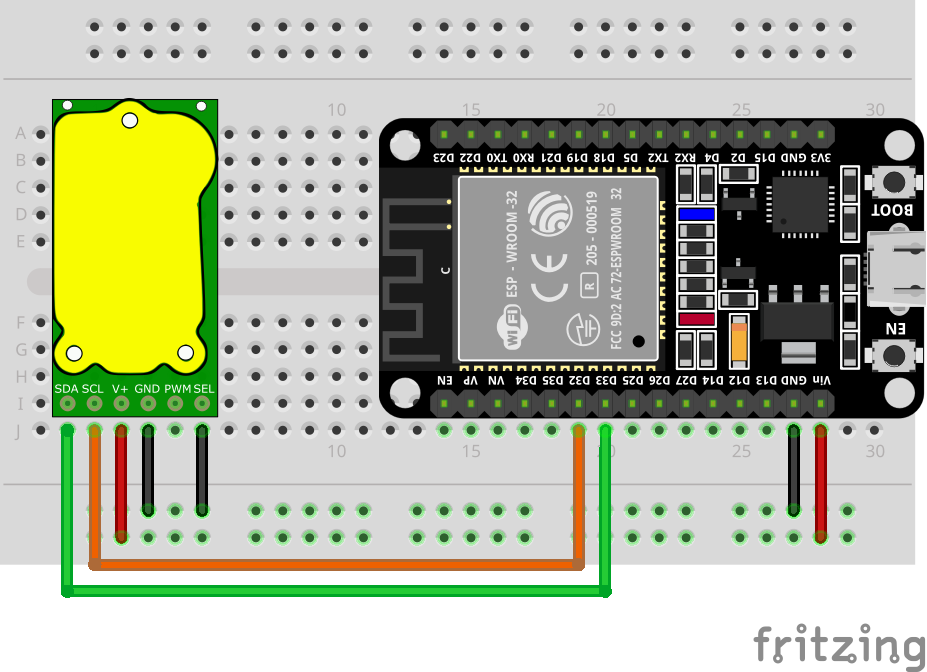

# Simple example with ESP32, T6703 and non-default I<sup>2</sup>C pins

## Connections

ESP32 Board: DOIT ESP32 DEV KIT v1  

Default I<sup>2</sup>C pins for ESPHome:  
SDA - GPIO21  
SCL - GPIO22

Used pins:  
SDA - GPIO33  
SCL - GPIO32




| T6703   | ESP32        | DC 5v |
|---------|--------------|-------|
| 1 - SDA | D33 - GPIO33 |       |
| 2 - SCL | D32 - GPIO32 |       |
| 3 - V+  | Vin          | +5    |
| 4 - GND | GND          | GND   |
| 5 - PWM |              |       |
| 6 - SEL |              | GND   |

## ESPHome config

```yaml
# Core
esphome:
  name: example-esp32-t6703

esp32:
  board: esp32doit-devkit-v1
  framework:
    type: arduino

# Enable logging
logger:

# Enable Home Assistant API
api:
  encryption:
    key: "+nFmYLQgoA5LGWSoqMQEsx+PVBPekwZhQVOj15qMyR4="

ota:
  password: "cd57554b463e9e4dde8b367c3eb2ae60"

wifi:
  ssid: !secret wifi_ssid
  password: !secret wifi_password

  # Enable fallback hotspot (captive portal) in case wifi connection fails
  ap:
    ssid: "Example-Esp32-T6703"
    password: "19vSV9RNK312"

captive_portal:


web_server:
  port: 80

# Non-default i2c settings
i2c:
  - id: bus_a
    sda: 33
    scl: 32
    scan: true

# T6703
external_components:
  - source: github://yellow-sky/esphome_t67xx
    components: [ t67xx_i2c ]

sensor:
  platform: t67xx_i2c
  i2c_id: bus_a
  co2:
    name: "T6703 CO2 Value"
    id: T6703_co2
  update_interval: 5s
```