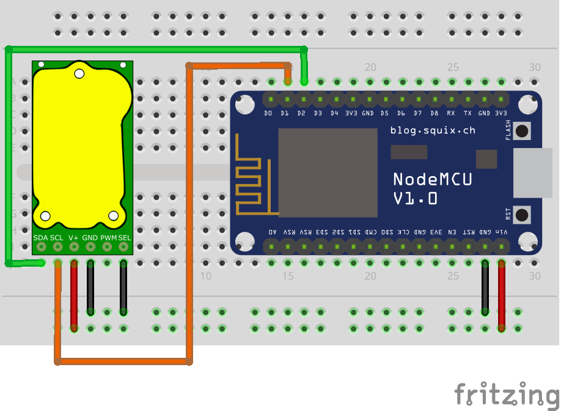

# Simple example with ESP8266 and T6703

## Connections

ESP8266 Board: NodeMCU v1.0  

Default I<sup>2</sup>C pins for ESPHome:  
SDA - GPIO5  
SCL - GPIO4  



| T6703   | ESP8266    | DC 5v |
|---------|------------|-------|
| 1 - SDA | D2 - GPIO5 |       |
| 2 - SCL | D1 - GPIO4 |       |
| 3 - V+  | Vin        | +5    |
| 4 - GND | GND        | GND   |
| 5 - PWM |            |       |
| 6 - SEL |            | GND   |

## ESPHome config

```yaml
# Core
esphome:
  name: example-8266-t6703

esp8266:
  board: nodemcuv2

# Enable logging
logger:

# Enable Home Assistant API
api:
  encryption:
    key: "mS48mrI/X0pDOtf8sz9A2e3Moujv0sCfNBzgSOmDjXU="

ota:
  password: "edb8e5bd6ef57c0ff28094356b6bac78"

wifi:
  ssid: !secret wifi_ssid
  password: !secret wifi_password

  # Enable fallback hotspot (captive portal) in case wifi connection fails
  ap:
    ssid: "Example-8266-T6703"
    password: "4888nluh5WwX"

captive_portal:

web_server:
  port: 80

# Default i2c settings
i2c:

# T6703
external_components:
  - source: github://yellow-sky/esphome_t67xx 
    components: [ t67xx_i2c ]
    
sensor:
  platform: t67xx_i2c
  co2:
    name: "T6703 CO2 Value"
    id: T6703_co2
  update_interval: 10s
```